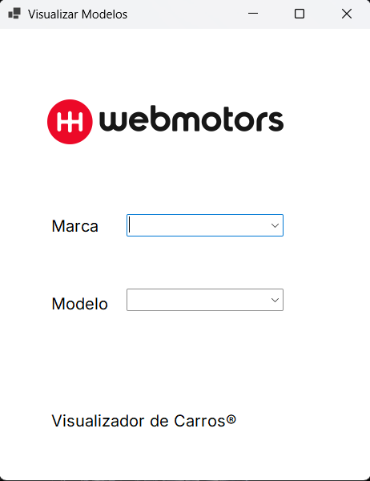
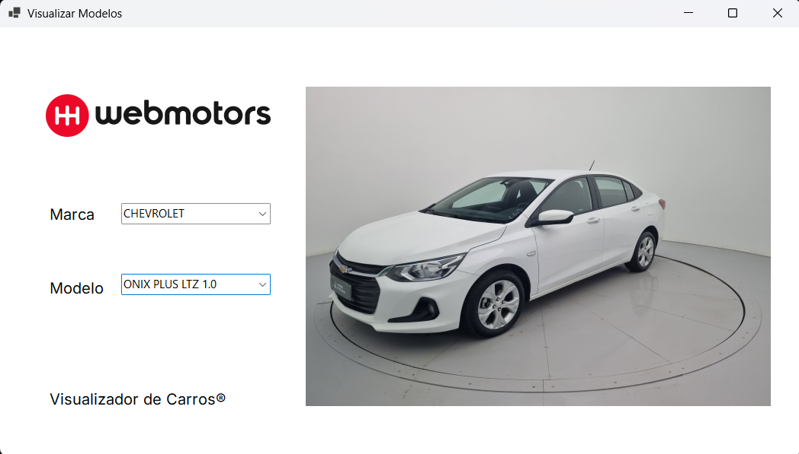

# Visualizador de Produtos

Aplicativo desktop desenvolvido em C# com Windows Forms para visualização de veículos por marca e modelo.

---

## Demonstração

### Tela Inicial

### Selecionando Marca e Modelo

---

## Funcionalidades

- Seleção intuitiva de marca e modelo de veículos através de comboboxes.
- Exibição dinâmica da imagem correspondente ao modelo escolhido.
- Carregamento de imagens a partir de pasta relativa ao executável.
- Interface clean e responsiva com Windows Forms.
- Suporte a múltiplas marcas: Chevrolet, Fiat, Hyundai, Renault e Volkswagen.

---

## Tecnologias Utilizadas

- **.NET 9**
- **C# 13**
- **Windows Forms**
- **Git & GitHub**

---

## Como Executar

### Pré-requisitos

- Windows 10 ou superior.
- [.NET 9 SDK](https://dotnet.microsoft.com/download/dotnet/9.0) instalado.
- Visual Studio 2022 ou JetBrains Rider (opcional).

### Passo a passo

1. Clone o repositório: